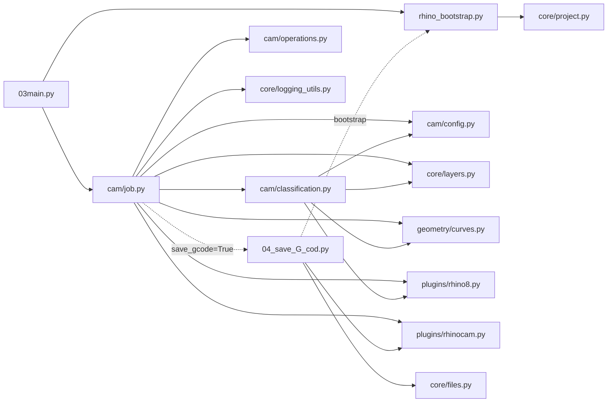

# Дерево Для `03main.py`

Это дерево показывает, какие внутренние файлы подключаются при запуске `03main.py`. Внешние модули Python, Rhino и RhinoCAM скрыты.

## Визуальная Схема



## То Же Самое Как Дерево

```text
03main.py
|-- rhino_bootstrap.py
|   `-- core/project.py
|
`-- cam/job.py
    |-- cam/config.py
    |-- cam/classification.py
    |   |-- cam/config.py
    |   |-- core/layers.py
    |   |-- geometry/curves.py
    |   `-- plugins/rhino8.py
    |
    |-- cam/operations.py
    |-- core/layers.py
    |-- core/logging_utils.py
    |-- geometry/curves.py
    |-- plugins/rhino8.py
    |-- plugins/rhinocam.py
    |
    `-- 04_save_G_cod.py
        |-- rhino_bootstrap.py
        |   `-- core/project.py
        |-- core/files.py
        `-- plugins/rhinocam.py
```

## Как Читать

- Сплошная стрелка означает обычную зависимость файла от файла.
- Пунктирная стрелка означает динамическую загрузку через `importlib` или запуск только при определенном сценарии.
- `04_save_G_cod.py` появляется в дереве, потому что `03main.py` запускает `cam_job.run(PROJECT_ROOT, save_gcode=True)`.
