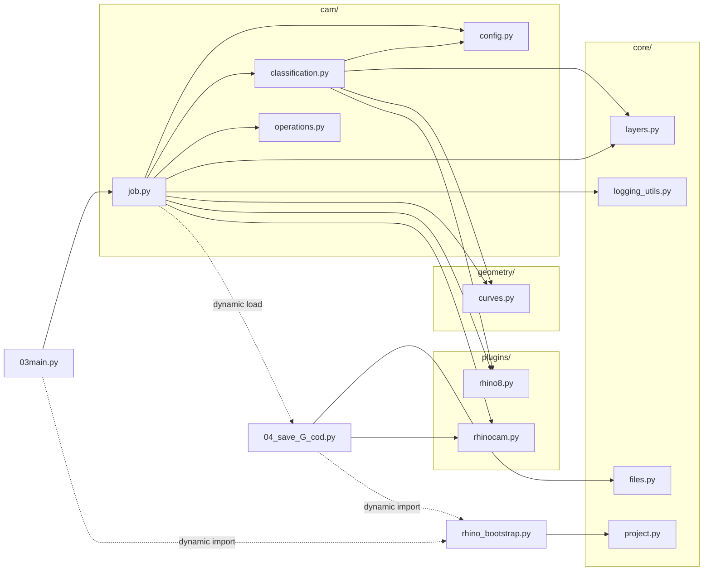

# Карта Зависимостей Файлов

Ниже показаны внутренние зависимости Python-файлов проекта. Внешние библиотеки и API Rhino/RhinoCAM не включены, чтобы схема оставалась читаемой.

Обычное дерево файлов проекта лежит отдельно: [FILE_TREE.md](FILE_TREE.md).



## Основной Поток

```text
03main.py
  -> rhino_bootstrap.py
  -> cam/job.py
       -> cam/config.py
       -> cam/classification.py
       -> cam/operations.py
       -> core/layers.py
       -> core/logging_utils.py
       -> geometry/curves.py
       -> plugins/rhino8.py
       -> plugins/rhinocam.py
       -> 04_save_G_cod.py
            -> core/files.py
            -> plugins/rhinocam.py
```

## Центральные Файлы

- `03main.py` - основная точка входа из RhinoCode.
- `rhino_bootstrap.py` - находит корень проекта и добавляет его в `sys.path`.
- `cam/job.py` - главный сценарий: создает setup, классифицирует кривые, добавляет операции, запускает сохранение G-code.
- `cam/operations.py` - сборка и настройка RhinoCAM-операций.
- `cam/classification.py` - распределение кривых по типам обработки.
- `04_save_G_cod.py` - отдельный модуль сохранения готовых setup в файлы G-code.

## Примечание

Пунктирные стрелки обозначают связи через `importlib` или загрузку модуля по пути, а не обычный `import`.
